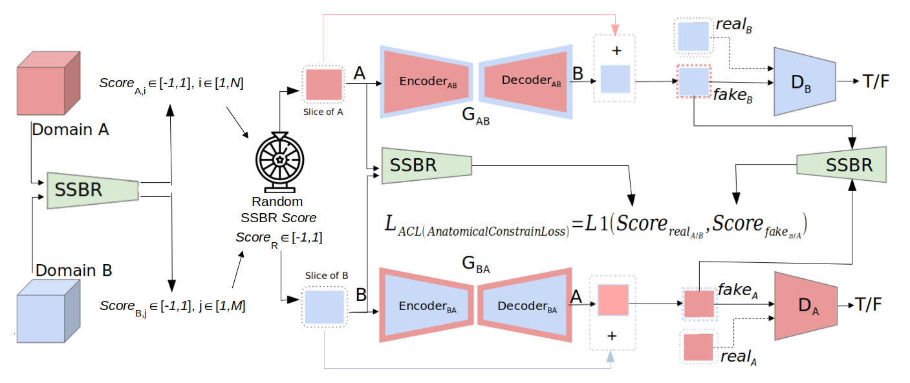

# DeePRAC Project
## Learning anatomical digital twins in pediatric 3D imaging for renal cancer surgery

# Segmentation of kidneys and renal tumors on pediatric abdominal-visceral ceCT scanners via deep learning

## myU-Net

STARTING FROM ADULTS: [Database MICCAI KiTS19](https://kits19.grand-challenge.org/data/)

Inspired by the winner of this challenge: "nnU-Net" [framework](https://github.com/MIC-DKFZ/nnUNet)
(winner adults' weights are available from the previous link)

The use of myU-Net is strictly linked to this

The steps to use it are as follows:

1. Install PyTorch and nnU-Net following the instructions in the previous link

2. Prepare the dataset for using it with the [framework](https://github.com/MIC-DKFZ/nnUNet/blob/master/documentation/dataset_conversion.md). In my codes, there is 'Prepare_as_nnunet.py' to make the work easier.

3. Run the nnU-Net preprocess "nnUNet_plan_and_preprocess -t XXX --verify_dataset_integrity", instructions in the framework link.

4. To speed up learning and make it more deterministic, prepare Patches (3D) or Slices (2D) using the code "Prepare_in_slices_or_patches.py"

5. Now you can run the 'main.py' where you can choose between different networks and set some parameters. Run 'python main.py -h' to discover all the options.

### Automatic size and pose homogenization with Spatial Transformer Network to improve and accelerate pediatric image segmentation

We propose a new architecture composed of STNpose-size three neural networks: a first Spatial Transfomer Network (STN) that deals with homogenization of pose and size [STN1]; a second STN that crops the homogenized image in the region  of interest (ROI) [STN2]; and finally a segmentation network, built as a nnU-Net, in which the cropped homogenized image is given as input and the output is then restored to its original pose and size, and uncropped, using the inverse of the two transformation matrices previously computed

This approach led to a paper accepted at the IEEE International Symposium of Biomedical Imaging (ISBI) 2021 [ISBI-21]
Link to the [paper](https://arxiv.org/pdf/2107.02655.pdf)

Networks to choose from (see Train_and_Test.py for details):
- **nunet2D**
- nnunet2.5D
- **nnunet3D**
- -----
- pnet3D
- p-nnunet3D (p-net3D+nnunet3D for only inference)
- -----
- stnpose-nnunet2D (training sequentially the two network)
- stncrop-nnunet2D (sequentially)
- stncrop3-nnunet2D (sequentially)
- stnpose-stncrop-nnunet2D (sequentially)
- stnpose-nnunet3D (sequentially)
- -----
- **stnpose2D**
- stnposennunet2D (training only nnunet2D using pre-trained stnpose2D)
- stncrop2D (backbone to choose: original stn or faster-rcnn)
- **stnposecrop2D**
- **stnposecropnnunet2D** (training only nnunet2D  using pre-trained stnpose and stncrop)
- ---
- stnpose3D
- stncrop3D (backbone to choose: original stn in 3D or nnDetection)
- stnposecrop3D 

---------------------------------
# Cross-domain CT image translation using CycleGAN

## acgan and UNIT
Inspired by the original [CycleGAN](https://github.com/junyanz/pytorch-CycleGAN-and-pix2pix) and [UNIT](https://github.com/mingyuliutw/UNIT) models and codes.

- UNIT: create configuration yaml file (setting generator, discriminator and hyperparameters), then run train.py and then test_batch.py (in case follow original TUTORIAL.md). [PBS method](https://arxiv.org/pdf/1809.04536.pdf) for slice selection already set as baseline in train.
- Cyclegan (inside acgan): set configuration from main, possible generators and discriminators are available in respective files in arch folder. Method to choose: 
- - cycleGANv0 : original CycleGAN
- - cycleGANv0_PBS : PBS method for slice selection
- - cycleGANv0_affinePBS : [3D affine registration](https://simpleelastix.github.io/) + PBS method

### ceCT-CT image translation using CycleGAN with anatomical constraints
We propose an extension of the CycleGAN method which includes:
1. the automatic selection of the region of interest by exploiting anatomical information, in order to reduce the anatomical distribution of 3D data acquired with different fields of view;
2. the use of a Self-Supervised Body Regressor (SSBR), adapted from, to select anatomically-paired slices among the unpaired ceCT and CT domains, and help the discriminator to specialize in the task;
3. the use of the SSBR score as an extra loss function that constrains the generator to produce a slice describing the same anatomical content as the input, inspired from the auxiliary classifier GAN;
4. the use of the input image as a template for the generator, and the use of an anatomical binary mask to constrain the output.

The proposed translation method led to a paper accepted at the Colloque Francophone de Traitement du Signal et des Images (GRETSI) 2022 [GRETSI- 22]. Its extended version (with improvement on SSBR training, more exhaustive qualitative and quantitative evaluation, application on blood vessel segmentation) has recently been accepted at the British Machine Vision Conference (BMVC) 2022 [BMVC-22].
Link to the [paper](https://arxiv.org/pdf/2210.01713.pdf)

first train SSBR from ssbr folder (ssbr-train.py and ssbr-test.py), then choose a model in acgan among:
- - cycleGANv1_ssbrselection : only SSBR for anatomically-paired selection
- - cycleGANv1_ssbrloss : only SSBR as auxiliary classifier
- - **cycleGANv1_ssbracgan** : complete proposed method
---------------------------------
# Segmentation of tubular structures on pediatric abdominal-visceral ceCT scanners with renal tumor

## State-of-the-art methods of renal tubular structures segmentation in ceCT images
In MyU-Net, we also implemented these sota methods (summarized in the following Table) as follow:

1. [M1.] The code of TopNet by [Keshwani et al. (2020)] (https://arxiv.org/pdf/2009.08674.pdf) is not publicly available. We implemented it from scratch, thanks to the kind help of the authors and to the supplementary material of the original paper. To obtain the full segmentation, we assign a label (arteries or veins) to each voxel of the vessel mask based on the label of nearest “center voxel” (calculated with the Dijkstra’s multi-source shortest path tree algorithm). The code would need an additional network for locating the sources for the application of the Dijkstra’s algorithm. However, due to the few details provided in the original article [Keshwani et al., 2020](https://arxiv.org/pdf/2009.08674.pdf) on this part, we decided to proceed as if this localization network was perfect, i.e. using sources points pre-determined by us. In this way, we only evaluate the ability of the TopNet method to provide a good segmentation and a correct topology, which is indeed our final goal.
2. [M2.] We implemented this code starting from the available code of M2 which can be a variant of M1. To be able to apply the idea of Deep Distance Transform method of [Wang et al. (2020)](https://arxiv.org/pdf/1912.03383.pdf) to formulate the distance prediction problem as a classification problem to two structures (i.e. arteries and vein), we propose that the discrete distance map of veins is added to the discrete distance map of arteries. We add K_A (maximum possible distance of the distance map of arteries) to all values of the distance map of veins where different from 0 (the distance map is 0 where the reference segmentation is 0 so this idea cannot produce errors). In this way the final distance map D map presents values from 0 to K_A + K_V , where K_V is the maximum possible distance of the distance map of veins. By doing so, after quantization, the final distance map D map as well as the second output will have K A +K V +1 channels. We coded also the Geometry-Aware Refinement (GAR) presented the work of Wang et al. (2020), in order to refine the segmentation output with the quantized distance map output.
3. [M3.] This is a variant of the Deep Distance Transform method of Wang et al. (2020) that was implemented by [Ma et al. (2020)](https://github.com/JunMa11/SegWithDistMap): the second channel, i.e. the distance map, is not quantized. Ma et al. (2020) used an L1 norm as loss between the reference distance map D map and the second output of the network (Conv3D 1x1x1 with no activation function). This implementation makes it easier to use the distance map for multiple structures but does not respect the idea of the original paper of Wang et al. (2020) (M1).
4. [M4.] We implemented the DenseBiasedU-Net of [He et al.(2020)](https://hal.archives-ouvertes.fr/hal-02614243/document) as in the original paper from scratch. Each dense biased connection compresses via a convolutional layer the feature maps in each layer of the U-Net at only 4 feature maps. Then, these are transmitted and concatenated to every forward layer. The reduction is done in order to reduce feature redundancy while keeping the integrity of information flow and gradient flow, allowing also to fuse multi-scale features. In order to fit the network in a 16 Gb GPU, the 3D U-Net has depth of one layer less than the other methods. The HRA and DPA techniques were not implemented due to their low contribution in improving performance and the limited database at our disposal.
5. [M5.] We implemented this code starting from the avaiable code of Method 5, using only CE in the loss function and with the different oversampling method presented in [Kid-Net paper](https://arxiv.org/pdf/1806.06769.pdf).
6. [M6.] The original implementation is available online for nnU-Net of Isensee et al. (2021) [see above for other details, here our reproduction ""myU-Net"].

To choose these methods add the optional argument --deepsup followed by:
1. [M1.] topnet (together with network choice as 'TopNet' instead of 'nnunet3D')
2. [M2.] ddt/ddt-gar  (choose between the two, you must run Find_k_ddt.py before and then change it on the code)
3. [M3.] dist
4. [M4.] dense
5. [M5.] ce
6. [M6.] deep

## Proposed tubular structures loss function
We propose a new loss function designed from the so-called vesselness function to improve state-of-the-art results. This loss is based on the comparison of eigenvalues of the Hessian matrix of segmentation masks and Frangi’s vesselness enhancement on target voxels in a multi-scale deep supervision way. The combination of this tubular structures loss with voxel-wise loss functions allows to overcome some problem of the latter, such as the difficulty in correctly optimizing tubular structures with elongated shape, intra-scale changes and inter-anatomy variation.
Our vesselness loss function, named Tubular structures Loss - T sLoss, is composed of two parts: a first loss function to check the morphology of the structures, named Morphological similarity Loss function and denoted by MsLoss, by comparing the eigenvalues ordered by the eigenvectors matrix; a second loss function to force prediction of elongated structures as in Frangi’s vesselness function, and thus named Frangi’s vesselness Loss function FvLoss.
Following Figure shows the complete pipeline for the proposed tubular structures loss function. 

Details will be released in a future journal paper. The relative code implementation is in myU-Net/utils/vesselness_torch.py.
(The code implementation is just for 3D images/patches, not yet implemented for 2D images/slices)

To choose the different implementation add the optional argument --deepsup followed by "deepvessel" + (no space):
- msloss (just morphological similarity loss on all pixels - very very long, not suggested to use)
- fvloss
- tsloss (tubular structures loss on all pixels - even longer, not suggested)
- gtmsloss (calculating eigenvalues over the entire image is expensive in terms of computational time, and the use of dilation revealed to be sufficient for our purpose thanks also to the combined use of voxel-wise loss functions)
- gttsloss
- gtdeepmsloss (in order to inject as much information as possible to the network, we do the same loss for the subsequent three output levels of resolution using the Deep Supervision technique. See figure for details)
- **gtdeeptsloss**  (SUGGESTED TO USE. The one presented in the Figure pipeline)

Example: --deepsup deepvesselgtdeeptsloss

Other losses implemented:
- gtfrangissvmd
- gtjermanssvmd
- gdl (general dice loss)
- gdlandbl (gdl + boundary loss)
- fnr (false negative rate loss)
- radialloss

---------------------------------
# Application of anatomical digital twins for renal cancer surgery

## PlugInSlicer
Our plug-in is developed as a module in 3DSlicer (version 4.11), named “Renal Anatomy Segmentation For ceCT” module. An overview of the module is shown in the following Figure

The module provides 5 sections:
- Help & Acknowledgment. Here there is a brief explanation of the module, the main of contributor and entities that granted and collaborated in the creation of the plug-in.
- Reload & Test. This section is used by developers when creating, editing, and debugging the module.
- Selection and Segmentation. This is the main section of the module, which is described in detail in the next paragraph.
- Segment Editor. This is the original 3DSlicer module for manual and semi-automatic segmentation that is linked to this section to allow the user to be able to refine results provided by the automatic segmentation method in the same interface.
- Data Probe. Default section of 3DSlicer that allows the arrow-pointer interaction with the displayed image, providing data of where the indicator is located, such as position in the 3D volume, HU or label value, name of segmentation structure and more.

The Selection and Segmentation section is decomposed into 5 different tasks to facilitate the user-interaction and to speed-up the inference phase for the automatic segmentation.

1. Once the medical image data (i.e. the ceCT scan) is loaded into 3DSlicer, the user can select it as input volume. Then, in order to activate the successive steps, the user has to create an output segmentation volume, where the results can be recorded. When both volumes are selected, the other buttons become active.
2. This button allows for an automatic segmentation of bones, liver and spleen, in order to have a 3D model as complete as possible. 
3. With the aim of speeding-up inference time and improving segmentation performances (reducing the amount of false positives), a 3D bounding box can be selected by the user. This step is not mandatory, and if it is not applied, then almost the whole image is used in the next steps (a bounding box of the voxels with non-zero values is used).
4. Once the bounding box is set, the user can create a new volume in which the cropped and pre-processed images will be saved. This step is not mandatory, and if is not applied, the original, un-processed, images are used next.
5. The last part is the main automatic segmentation task. Three buttons are available to segment respectively kidney and renal masses, ureters, and blood vessels (arteries and veins).

Instructions for installing are available inside the folder.

---------------------------------
## License
This code was developed by Giammarco La Barbera thanks to: (i) the database of the DeePRAC project provided by the abdominal-visceral surgery department of Necker hospital; (ii) the grants from Region Ile de France (DIM RFSI) and Philips Research France. 
The methods were devised through a collaboration among (1) LTCI-Télecom Paris, (2) LIP6-Sorbonne Université, (3) IMAG2-Necker hospital and (4) Philips Research France.

This code is under the Apache License 2.0.
# DeePRAC_project
# DeePRAC_project
